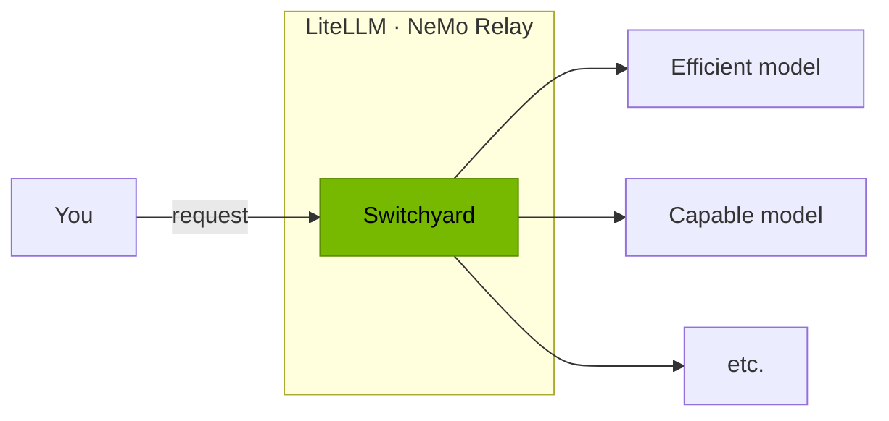
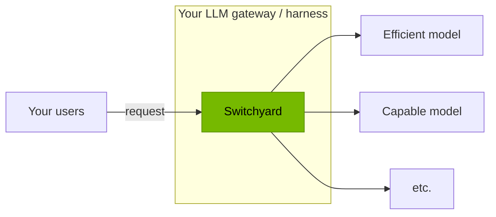
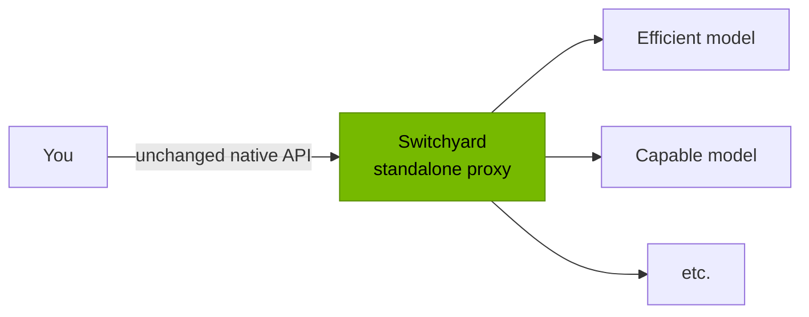

<p align="center">
  
</p>

# Switchyard

**Switchyard routes each LLM call to the cheapest model that can still do the job. Without changing a line of your agent.**

**[Get started →](#get-started)**


_\*Total cost based on average ISP token cost_

## What is Switchyard

Switchyard picks which model serves each LLM call.

### Use Switchyard

Switchyard runs inside gateways you may already have.

- **NeMo Relay** — a native plugin. Load a `routes.toml` into a Relay deployment
  you already run. [Setup →](#path-1--load-the-nemo-relay-plugin)
- **LiteLLM** — a routing plugin for LiteLLM's `Router` and proxy.
  [Setup →](examples/litellm/README.md)
- **More integrations** coming soon.



### Integrate Switchyard into your gateway or harness

Embed the routing algorithms in your own. Switchyard picks the model; your
harness makes the call, so your transport, retries, and credentials stay
untouched.

- Install: `pip install nemo-switchyard`
- Then follow [Path 2 — Embed the Library](#path-2--embed-the-library):
  construct an algorithm, drive its step stream, make the answer call.
- Also available for Rust as `switchyard-libsy`; Path 2 has the `Cargo.toml`
  block.



### Run Switchyard as a standalone proxy

A server in front of an agent, when you have no gateway to put Switchyard in.
Point Claude Code, Codex CLI, or any OpenAI/Anthropic SDK client at it;
Switchyard decides per turn which model serves it.

- Install: `cargo install --locked switchyard-server`
- Then follow [Path 3 — Run the Standalone Proxy](#path-3--run-the-standalone-proxy):
  write `routes.toml`, start the server, point your agent at it.



## Components

Pre-1.0 software. APIs, configuration, and routing behavior can change between
releases — pin the version you integrate.

| Component | Stability | Use it for | Guidance |
|---|---|---|---|
| `switchyard-libsy` | **Beta** | Routing embedded in your own gateway or harness. You own model calls, credentials, and retries. | Trial integrations. API will change before v1.0. |
| `switchyard-llm-client` | **Alpha** | HTTP model calls and protocol translation alongside libsy. | Experiments and pilots. |
| `switchyard-runner` | **Alpha** | Running configured routes inside another runtime, such as NeMo Relay. | Integration work and supervised pilots. |
| `switchyard-server` | **Demo** | A standalone OpenAI- and Anthropic-compatible proxy. | Demos and evaluation only. Not for production. |

## Get Started

Three paths, in the same order as above. Using Claude Code or Codex? Point it
at this README and ask it to set up the path you want.

### Path 1 — Load the NeMo Relay Plugin

You finish with an existing NeMo Relay deployment routing through Switchyard.
Requires NeMo Relay `>=0.8.0, <1.0.0` and a Rust toolchain.

Follow the plugin README's
[Install](crates/switchyard-nemo-relay-plugin/README.md#install) and
[Configure Relay](crates/switchyard-nemo-relay-plugin/README.md#configure-relay)
sections. For the deployment file, use the `routes.toml` from
[Path 3, step 2](#path-3--run-the-standalone-proxy).

### Path 2 — Embed the Library

You finish with your own harness picking a model per request and still making
every model call itself. Shown in Python; the Rust API has the same shape.

**1. Install.**

```bash
pip install git+https://github.com/NVIDIA-NeMo/Switchyard.git
```

The API below is newer than `nemo-switchyard` 0.2.0 on PyPI, so install from
source until the next release. Rust: depend on `switchyard-libsy` and
`switchyard-protocol` from this repository instead. Pin both to the commit you
tested — `@<sha>` for pip, `rev = "<sha>"` for Cargo — before depending on them.

**2. Construct an algorithm.** It selects a category — `efficient` or
`capable` — and you map categories to model IDs when each request runs.

```python
from switchyard.libsy import LlmResponse, Step
from switchyard.libsy.algorithms import stage_router

algorithm = stage_router(picker="efficient_first", confidence_threshold=0.5)
```

**3. Drive it.** `run_stream` yields steps. Serve each `CallModel` with your own
client — `call.models` is ordered by preference, and `call.fail(error)` reports
a failed call; `Done` carries the pick.

```python
models = {"efficient": ["fast"], "capable": ["quality"], "any": ["quality", "fast"]}

async for step in algorithm.run_stream(request, models):
    match step:
        case Step.CallModel(call):
            call.respond(LlmResponse.Agg(await my_client(call.request, call.models[0])))
        case Step.Done(outcome):
            model, request = outcome.selected_model_ids[0], outcome.request
```

**4. Make the answer call** with `model` and `request`, using your own HTTP
client, retries, and credentials.

The complete runnable version — streaming and a working client — is
[`examples/libsy.py`](examples/libsy.py). Types:
[`switchyard-libsy`](crates/libsy/README.md),
[`switchyard-protocol`](crates/protocol/README.md).

### Path 3 — Run the Standalone Proxy

You finish with a server on `localhost:4000` that any OpenAI or Anthropic client
can call. Needs [Rust with Cargo](https://rust-lang.org/tools/install/).
For v0.3.0, the standalone server is release-validated on Ubuntu 24.04,
Linux x86_64. Other platforms are outside the release-validation scope.

**1. Install the server.**

```bash
cargo install --locked switchyard-server
```

**2. Write `routes.toml`.** A stage router over the same model pair as the
benchmark above: how to reach a provider, which models to use, how to choose
between them. `--config` takes any path; this writes it to the current directory.

```bash
cat > routes.toml <<'TOML'
schema_version = 1

[llm_clients.openrouter]
format = "openai_chat"
base_url = "https://openrouter.ai/api/v1"
api_key_env = "OPENROUTER_API_KEY"

[targets.capable]
id = "anthropic/claude-opus-4.8"
llm_client = "openrouter"

[targets.efficient]
id = "z-ai/glm-5.2"
llm_client = "openrouter"

[routes.switchyard]
id = "switchyard"
type = "stage_router"
capable_target = "capable"
efficient_target = "efficient"
picker = "efficient_first"
confidence_threshold = 0.5
TOML
```

Every key is documented in the [TOML schema reference](docs/reference/toml_schema.md).

**3. Start it.** `--dry-run` loads the config, prints `server OK:` and the model
IDs it exposes, then exits without starting the server.

```bash
export OPENROUTER_API_KEY="your-openrouter-key"  # pragma: allowlist secret
switchyard-server --config routes.toml --dry-run
switchyard-server --config routes.toml --host 127.0.0.1 --port 4000
```

**4. Send a request.** The route's `id` is the model name clients ask for.

```bash
curl http://localhost:4000/v1/chat/completions \
  -H "Content-Type: application/json" \
  -d '{"model":"switchyard","messages":[{"role":"user","content":"hello"}]}'
```

The same route also answers on `/v1/messages` (Anthropic Messages) and
`/v1/responses` (OpenAI Responses). `/v1/stats` reports which target served
what, and `/metrics` exposes Prometheus counters for requests, errors, latency,
tokens, and routing overhead.

**5. Point a coding agent at it.**

```bash
export ANTHROPIC_BASE_URL="http://localhost:4000"
export ANTHROPIC_MODEL="switchyard"
export ANTHROPIC_API_KEY="placeholder"  # pragma: allowlist secret
claude
```

The placeholder satisfies Claude Code's client-side auth check. In this local
setup, Switchyard uses the server's `OPENROUTER_API_KEY` for upstream requests.
Do not use the placeholder with `forward_auth = true` or a gateway that requires
a real client credential.

For Codex CLI, add this provider to `~/.codex/config.toml`:

```toml
[model_providers.switchyard]
name = "Switchyard"
base_url = "http://localhost:4000/v1"
wire_api = "responses"
requires_openai_auth = false
```

Then select the provider and route:

```bash
codex --model switchyard -c 'model_provider="switchyard"'
```

No Codex API key is needed for this local setup. Switchyard uses the server's
`OPENROUTER_API_KEY` for upstream requests.

## Routing Algorithms

Start with **Auto**. Choose Task or Execution when you want more control over
how requests move between an efficient model and a capable one.

| Choice | Use it when | Route `type` |
|---|---|---|
| **[Auto](docs/routing_algorithms/overview.md#auto)** | You want Switchyard's recommended preset. | `auto` |
| **[Task](docs/routing_algorithms/llm_classifier_routing.md)** | You want an LLM to judge which model can handle the task. | `llm_classifier` |
| **[Execution](docs/routing_algorithms/stage_router_routing.md)** | You want tool results and agent progress to guide each request. | `stage_router` |

Auto currently uses Execution with fixed defaults and no LLM judge. Task uses
the LLM classifier's capability mode. Execution uses the stage router.
These names do not change the TOML configuration keys.

> Auto requires a [source build](docs/getting_started.md#build-from-source) until v0.3.0 is published. The quickstart above uses `stage_router` directly.

See the [full routing catalog](docs/routing_algorithms/overview.md#more-options)
for composite routing, escalation, custom policies, and other options.
Performance results are listed under [Benchmark Provenance](#benchmark-provenance).

## Documentation

- **[Core Concepts](docs/core_concepts.md)**: LLM clients, targets, routes, model IDs, and routing algorithms
- **[Routing Overview](docs/routing_algorithms/overview.md)**: choose and configure a routing algorithm
- **[TOML Schema](docs/reference/toml_schema.md)**: every configuration key
- **[Architecture](docs/architecture.md)**: how the proxy and library components fit together
- **[switchyard-server](crates/switchyard-server/README.md)**: server configuration, routing algorithms, and metrics
- **[switchyard-libsy](crates/libsy/README.md)**: embed routing algorithms in a Rust application
- **[switchyard-protocol](crates/protocol/README.md)**: provider-neutral request, response, and streaming types
- **[switchyard-translation](crates/switchyard-translation/README.md)**: request, response, and stream translation
- **[switchyard-nemo-relay-plugin](crates/switchyard-nemo-relay-plugin/README.md)**: install Switchyard as a native NeMo Relay plugin

## Benchmark Provenance

| Configuration | Accuracy | Total cost | vs. Opus 4.8 baseline |
|---|---:|---:|---|
| Opus 4.8 baseline | 76.0% | $98.06 | — |
| **[Escalation](docs/routing_algorithms/escalation_router_routing.md)** | 75.7% | $85.00 | 99.6% of accuracy, 13.3% cheaper |
| **[Execution (Stage)](docs/routing_algorithms/stage_router_routing.md)** | 72.7% | $68.19 | 95.7% of accuracy, 30.5% cheaper |
| **[Task (Capability)](docs/routing_algorithms/llm_classifier_routing.md)** | 71.2% | $79.32 | 93.7% of accuracy, 19.1% cheaper |
| Kimi K2.6 alone | 55.8% | $76.28 | |
| GLM 5.2 alone | 52.4% | $16.47 | |
| DeepSeek V4 Pro alone | 48.7% | $96.92 | |
| Ultra 3 alone | 39.0% | $29.66 | |

These are the v0.2.0 Terminal-Bench 2.1
results from [Route AI Agent Workloads Across Models with NVIDIA NeMo Switchyard](https://developer.nvidia.com/blog/route-ai-agent-workloads-across-models-with-nvidia-nemo-switchyard/).
Those runs used NVIDIA-internal inference endpoints, so absolute solve rates may
shift on another serving stack; the routing parameters are the ones that ran.

The escalation deployment is checked in at
[`benchmark/routing-profiles/tb21-escalation-opus-glm-deepseek.toml`](benchmark/routing-profiles/tb21-escalation-opus-glm-deepseek.toml),
with OpenRouter targets substituted so it is publicly runnable. To run the
harness, see [`benchmark/README.md`](benchmark/README.md); for latency and
routing overhead rather than task success, see
[Soak Testing](docs/operations/soak_test.md).

## Community

- **Issues**: [GitHub Issues](https://github.com/NVIDIA-NeMo/Switchyard/issues)
- **Code of Conduct**: [Code of Conduct](CODE_OF_CONDUCT.md)

## License

[Apache 2.0 License](LICENSE). Copyright NVIDIA Corporation.
