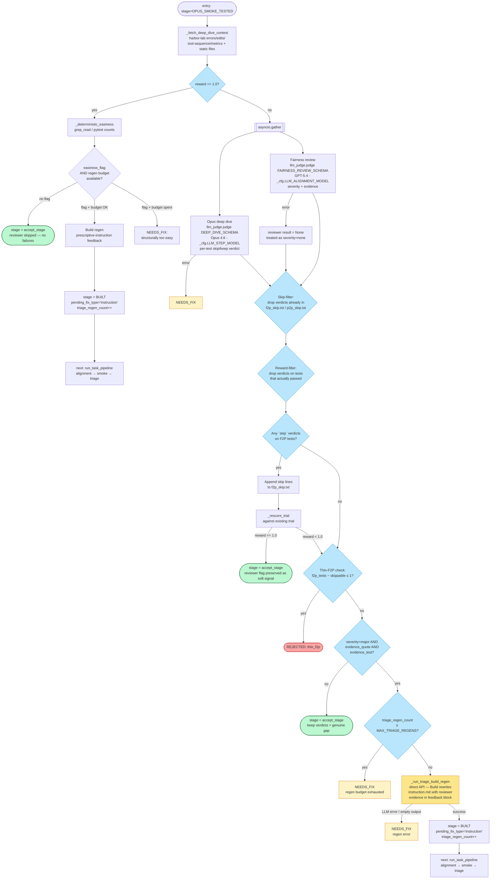
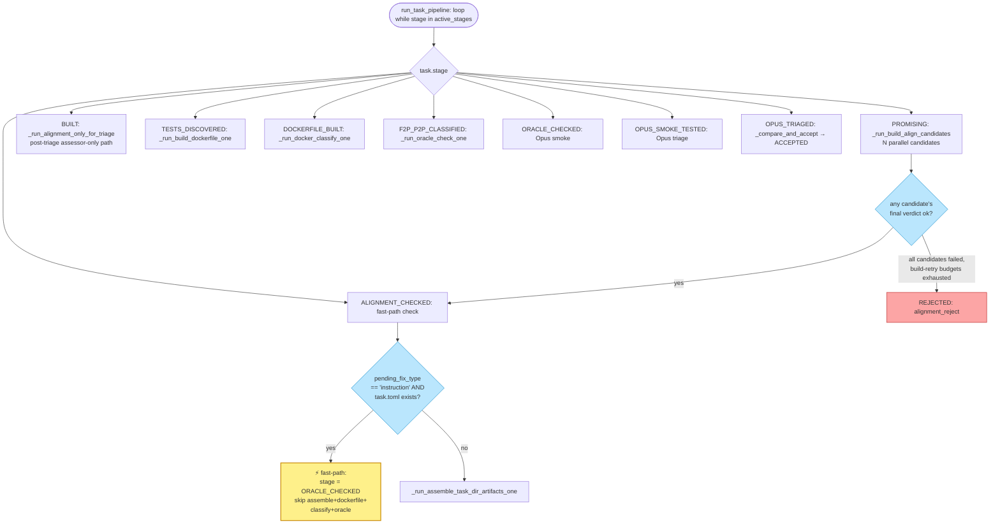

# craft-taskgen Pipeline State Machine

Map of the Tools (tool-orchestration) pipeline after the direct-API
refactor. Source of truth for stage transitions, regen routing, and
fast-paths.

## Happy-path stage machine

```mermaid
stateDiagram-v2
    direction LR

    [*] --> CANDIDATE: miner
    CANDIDATE --> EVALUATED: select_candidates
    EVALUATED --> PROMISING: step_evaluate (accept)
    EVALUATED --> REJECTED: step_evaluate (reject)
    EVALUATED --> REJECTED: max_promising_per_repo cap

    PROMISING --> ALIGNMENT_CHECKED: _run_build_align_candidates (any of N candidates passed)
    PROMISING --> REJECTED: _run_build_align_candidates (all N candidates failed)
    BUILT --> ALIGNMENT_CHECKED: _run_alignment_only_for_triage (post-triage Build regen path)
    ALIGNMENT_CHECKED --> TESTS_DISCOVERED: _run_assemble_task_dir_artifacts_one
    TESTS_DISCOVERED --> DOCKERFILE_BUILT: _run_build_dockerfile_one
    DOCKERFILE_BUILT --> F2P_P2P_CLASSIFIED: _run_docker_classify_one
    F2P_P2P_CLASSIFIED --> ORACLE_CHECKED: _run_oracle_check_one (RESOLVED)

    ORACLE_CHECKED --> OPUS_SMOKE_TESTED: Opus harbor smoke
    OPUS_SMOKE_TESTED --> OPUS_TRIAGED: _run_triage_one (accept)
    OPUS_TRIAGED --> ACCEPTED: _compare_and_accept

    NEEDS_FIX: NEEDS_FIX<br/>(human review)
    REJECTED: REJECTED<br/>(terminal)
    ACCEPTED: ACCEPTED<br/>(terminal)
```

**What changed** (vs. the pre-refactor diagram):

- Evaluate emits a **binary** `accept`/`reject` verdict — no `MAYBE` band.
- **Hardness check deleted.** H-rule enforcement moved upstream into
  the Build prompt; audit moved downstream into the alignment judge.
- **Alignment judge** (new): GPT-5.4 cross-family audit of
  instruction ↔ reference-test alignment. Two retry mechanisms apply,
  addressing different failure modes:
  - **Assessor retry** (judge-flakiness mitigation): re-poll the
    judge on the *same instruction* up to `_cfg.ALIGNMENT_MAX_RETRIES`
    times; accept on first `ok`. Default α=1 (Apr 25 2026 update —
    no retention bias; single roll per evaluation). Earlier α=3
    biased toward retention (one `ok` would override multiple `no`s,
    letting borderline-leaky instructions through). Profile knob;
    can be raised back to 3 via TOML if false-alarm rate becomes a
    problem in production.
  - **Build retry** (instruction-flakiness mitigation): if assessor
    rejected with `leaked`/`narrow_tests`, a Build regen runs with
    the assessor's leakage-evidence in the prompt, then a fresh
    assessor evaluation on the new instruction. Bounded at
    `_cfg.MAX_BUILD_REGENS_PER_CANDIDATE` per pipeline (default 2;
    profile knob).
- **N parallel build+alignment candidates per task** (Apr 2026 — addresses
  a third failure mode: *unlucky build*): Build is non-deterministic —
  the same PR can produce a clean instruction on one roll and a leaky
  one on another. Neither assessor retry (which doesn't change the
  instruction) nor build retry (which can't always rescue a structurally
  bad instruction) handles this. The orchestrator runs
  `_cfg.BUILD_N_CANDIDATES` (default 2) independent build → assessor →
  build-retry → assessor loops concurrently per task; picks a passing
  candidate uniformly at random; rejects only when all candidates fail.
  See `_run_build_align_candidates` and `_one_candidate_loop`.
- **Haiku smoke deleted.** After OPUS_TRIAGED the task goes straight
  to `_compare_and_accept`, which now just sets ACCEPTED. Rank-inversion
  and both-zero gates removed (0 fires across ~500 bulk-run tasks).

## Failure sinks

```mermaid
flowchart TD
    subgraph Evaluate
        E1[step_evaluate]
        E1 -->|verdict=reject| R0[REJECTED: eval_reject]
        E1 -->|direct-API / schema error| NF0[NEEDS_FIX: eval_error]
    end

    subgraph BuildAlign["Build + Alignment (N parallel candidates)"]
        BA1[_run_build_align_candidates]
        BA1 -->|all N candidates: build infra error| NF1[NEEDS_FIX: build_exhausted]
        BA1 -->|all N candidates: assessor non-ok non-actionable<br/>vague/misaligned| R1[REJECTED: alignment_reject]
        BA1 -->|all N candidates: assessor non-ok actionable<br/>leaked/narrow_tests, build-retry budget exhausted| R1b[REJECTED: alignment_reject]
    end

    subgraph Assemble
        A1[_run_assemble_task_dir_artifacts_one]
        A1 -->|solve.sh gen fail| NF4a[NEEDS_FIX: solve_gen_failed]
        A1 -->|git infra failure| NF4b[NEEDS_FIX: git_infra]
        A1 -->|no test files in diff| NF4c[NEEDS_FIX: no_test_files]
        A1 -->|all postmerge extracts failed| NF4d[NEEDS_FIX: postmerge_extract_failed]
    end

    subgraph BuildDockerfile
        BD1[_run_build_dockerfile_one]
        BD1 -->|Claude error| NF5a[NEEDS_FIX: dockerfile_claude_error]
        BD1 -->|Dockerfile not created| NF5b[NEEDS_FIX: dockerfile_not_created]
    end

    subgraph Classify
        C1[_run_docker_classify_one]
        C1 -->|OVERLAY_UNCOLLECTED| R2[REJECTED: overlay_uncollected]
        C1 -->|OVERLAY_REGRESSION| R3[REJECTED: test_regressed]
        C1 -->|ORACLE_ZERO after fix fails| NF7[NEEDS_FIX: classify_oracle_empty]
    end

    subgraph Oracle
        O1[_run_oracle_check_one]
        O1 -->|f2p<1 or p2p<1| NF8[NEEDS_FIX: oracle_not_resolved]
    end

    subgraph Smoke
        S1[harbor run smoke]
        S1 -->|timeout 30min| NF9[NEEDS_FIX: smoke_timeout]
        S1 -->|infra_failure / no_trial| NF10[NEEDS_FIX: smoke_infra]
    end

    subgraph Triage
        T1[_run_triage_one]
        T1 -->|thin F2P: remaining ≤1| R4[REJECTED: thin_f2p]
        T1 -->|deep-dive direct-API error| NF12[NEEDS_FIX: triage_error]
        T1 -->|triage_regen_count ≥ MAX_TRIAGE_REGENS| NF13[NEEDS_FIX: triage_regen_exhausted]
        T1 -->|Build regen LLM error| NF14[NEEDS_FIX: triage_regen_error]
    end

    style NF0 fill:#fef3c7,stroke:#d97706
    style NF1 fill:#fef3c7,stroke:#d97706
    style NF4a fill:#fef3c7,stroke:#d97706
    style NF4b fill:#fef3c7,stroke:#d97706
    style NF4c fill:#fef3c7,stroke:#d97706
    style NF4d fill:#fef3c7,stroke:#d97706
    style NF5a fill:#fef3c7,stroke:#d97706
    style NF5b fill:#fef3c7,stroke:#d97706
    style NF7 fill:#fef3c7,stroke:#d97706
    style NF8 fill:#fef3c7,stroke:#d97706
    style NF9 fill:#fef3c7,stroke:#d97706
    style NF10 fill:#fef3c7,stroke:#d97706
    style NF12 fill:#fef3c7,stroke:#d97706
    style NF13 fill:#fef3c7,stroke:#d97706
    style NF14 fill:#fef3c7,stroke:#d97706
    style R0 fill:#fca5a5,stroke:#b91c1c
    style R1 fill:#fca5a5,stroke:#b91c1c
    style R1b fill:#fca5a5,stroke:#b91c1c
    style R2 fill:#fca5a5,stroke:#b91c1c
    style R3 fill:#fca5a5,stroke:#b91c1c
    style R4 fill:#fca5a5,stroke:#b91c1c
```

## Triage internals (`_run_triage_one`)

Parallel dual deep dive (primary Opus + secondary GPT-5.4, same
pre-assembled evidence), deterministic per-failure merge, filter chain,
then classify + deterministic auto-skip + optional Build regen. The
claude-p fix-agent that edited instruction / skip / Dockerfile files
was replaced with a single direct-API Build regen call that rewrites
`instruction.md` from a `<triage_feedback>` block; Dockerfile and skip
edits are handled deterministically or not at all at triage time.

## Per-task control loop (`run_task_pipeline`)

Dispatches each task through stages based on current `stage` and
`pending_fix_type`. Two fast-path shortcuts keep the instruction-only
and dockerfile-only fix cycles from re-running work that can't change.

## Legend

- **Green (double border)** — ACCEPTED terminal state (happy path).
- **Green (single border)** — ACCEPTED via triage fast-path.
- **Red** — REJECTED terminal state.
- **Yellow (rounded)** — NEEDS_FIX (awaiting human review).
- **Blue (diamond)** — decision point (LLM classification or routing guard).
- **Pale yellow (stage label)** — fast-path shortcut that skips downstream steps.

## Model / transport per step

| Step | Transport | Model | Structured output |
|---|---|---|---|
| step_evaluate | direct API (litellm) | Opus 4.6 | EVALUATE_SCHEMA — binary verdict |
| _build_instruction (per candidate) | direct API | Opus 4.6 | BUILD_SCHEMA — instruction_md + task_slug |
| _run_alignment_retry (per candidate) | direct API | GPT-5.4 | ALIGNMENT_SCHEMA — verdict enum + V4 audit |
| _run_assemble_* | subprocess (git) | — | no LLM |
| _run_build_dockerfile_one | `claude -p` | Opus 4.6 | none (fs-writing agent) |
| _run_docker_classify_one | subprocess (docker) | — | no LLM |
| _run_oracle_check_one | subprocess (docker) | — | no LLM |
| _run_smoke_one | Harbor subprocess | Opus 4.6 | reward.json |
| _run_triage_one (Opus DD) | direct API | Opus 4.6 | DEEP_DIVE_SCHEMA — per-test `skip` / `keep` verdict. **Skipped when reward==1.0** (deterministic easiness runs instead). |
| _run_triage_one (fairness review) | direct API | GPT-5.4 | FAIRNESS_REVIEW_SCHEMA — `severity` enum + evidence quote + evidence test. Parallel with Opus DD; also skipped on reward==1.0. |
| _run_triage_build_regen | direct API | Opus 4.6 | BUILD_SCHEMA — rewrites instruction.md using reviewer evidence as feedback |
| _generate_summary | direct API | Opus 4.6 | SUMMARY_SCHEMA — one-line narrative |

Two-family design, separated concerns: Opus generates (evaluate / build
/ Opus DD / Build-regen / summary); GPT-5.4 judges at build-time
(alignment) and at triage-time (fairness review). No merge logic at
triage — the two judges answer different questions (per-test skip/keep
vs. task-level unfairness). No step has an LLM judging output from its
own family.

`REVIEWER_SCHEMA` and `skeptical_reviewer_prompt` remain in
`prompts.py` only so `scripts/calibrate-deep-dive.py` can replay
historical cohorts. They are not on the live triage path and can be
deleted once that calibration is retired.

## Key insights

### Where the complexity lives

1. **`_run_triage_one`** is the single most complex function —
   parallel Opus DD + fairness review, two filter stages (skip-file
   and reward.json), deterministic auto-skip + re-score, and the
   severity-gated Build regen branch. Everything else in the pipeline
   is sequential; this is where the branches multiply.

2. **Build retry loop is now internal to each candidate.** After the
   N-parallel refactor, the leaked/narrow_tests → Build regen path
   no longer toggles `stage = PROMISING` and bounces through the
   outer state machine. Each candidate's `_one_candidate_loop` runs
   the build → assessor → (build retry once) → assessor sequence
   end-to-end before returning. Only the orchestrator's outer
   stage transitions are visible to `run_task_pipeline`.

3. **Triage regen loop** is bounded by `task.triage_regen_count` (capped
   at `MAX_TRIAGE_REGENS`). The counter persists across pipeline
   iterations (not reset per triage entry) so a task can't bounce
   between triage and Build indefinitely.

4. **State persistence via `pending_fix_type`** outlives a single
   triage invocation — it's on `TaskState`, serialized to state.json.
   `_run_triage_build_regen` sets it to `"instruction"`;
   `run_task_pipeline` consumes it at ALIGNMENT_CHECKED for the
   fast-path that skips assemble/dockerfile/classify/oracle.

### Fast-paths (in order they fire)

| Name | When | Savings | Notes |
|---|---|---|---|
| Deep-dive skip-filter | Already-skipped tests surface in FAILED lines | Skip downstream filters for drop-outs | |
| Reward-filter | Classification points at a test that passed in-trial | Drops phantom classifications before accept/regen decisions | Parses reward.json f2p_failed/p2p_failed, falls back to pytest FAILED lines |
| Auto-write skip verdicts | Opus DD emits `skip` on an F2P test | Deterministic write + fast rescore | |
| Skip-then-rescore to reward=1.0 | Applying skips brings trial reward to 1.0 | Accept without re-smoke; reviewer concern (if any) preserved as soft signal | |
| all-keep accept | All DD verdicts are `keep`, thick enough F2P, reviewer not major+evidence | Accept at current score without regen | Task kept as hard-but-fair |
| Instruction-only re-alignment | After Build regen, task.toml still present | Skip assemble+dockerfile+classify+oracle | Only alignment + smoke + triage re-run |
| Alignment regen feedback | Alignment `leaked`/`narrow_tests` with evidence | Build retry with flagged phrases removed | |

### Easiness / "too easy" detection

**Inline signal (deterministic, no LLM):** `_deterministic_easiness`
in `steps.py`. On `reward == 1.0` trials, parses the harbor-lab
tool-sequence for Grep+Read count and pytest invocations. Sets
`easiness_flag = True` when `grep_read_count <=
_EASINESS_GREP_READ_MAX` (5 today). `pytest_runs` is recorded for
observability but does not trigger the flag on its own.

**Action, not soft flag.** On `easiness_flag=True`:
- First pass (regen budget available): triggers Build regen with
  prescriptive-instruction feedback from `easiness_triage_feedback_block`
  — asks Build to strip named files/classes/data-structures/procedural
  language while preserving outcome + API contracts. Task routes back
  through alignment → smoke → triage.
- Second pass (`triage_regen_count >= MAX_TRIAGE_REGENS`): shelves as
  `NEEDS_FIX` with `needs_human_review=True`. Regen didn't help →
  task is structurally too easy.

Budget is shared with the reviewer-regen path. Calibrated against the
Apr 17 2026 cohort — see `docs/reference/easiness-heuristics.md`.

**DD + reviewer are both skipped on `reward == 1.0`.** The per-test
skip/keep has nothing to classify and the fairness reviewer has no
failing-test anchor. We spend only the deterministic easiness check
before either accepting or routing through easiness regen. Saves 2 LLM
calls (~$0.15-0.30 + ~20s) per passing task.

**Offline companion:** `scripts/analyze-easiness.py` computes richer
cohort-relative stats (p10 wall time, p10 turns, edit counts) for
post-run batch analysis. Not inline — a human invokes it manually.

**Coverage gap acknowledged:** the deterministic check is
cause-agnostic — it flags low-exploration trajectories without
distinguishing "instruction leaked the answer" from "task was just
small and well-scoped." Subtle instruction-leakage patterns that
slip past the build-time alignment judge and produce a
recipe-following reward=1.0 solve will show up in the easiness flag
but won't be diagnosed. A targeted leakage-audit LLM call gated on
`easiness_flag = True` is a plausible follow-up if bulk-run data
shows this failure mode.

**Removed in Apr 23 2026 refactor:** the short-lived LLM
`easiness_signal` field in `DEEP_DIVE_SCHEMA` + the
`RUBRIC_EASINESS` four-rule rubric. Calibration on the Apr 17 cohort
showed the LLM rubric flagged 21/27 reward=1.0 tasks as `too_easy`
(78%) — the judges were hallucinating `no_exploration` triggers on
tasks that had 30-156 Grep+Read calls. The deterministic count caught
the one genuinely-suspicious case (spack-229aca2b, 9 Grep+Read) and
no others.

Legacy signal still on `TaskState` for state.json compatibility but
no longer populated: `easiness_concern`.

**Reviewer concern flag.** `reviewer_concern_flag` mirrors
`easiness_flag` semantically — a soft signal from the cross-family
fairness-review step that does not block acceptance.
`reviewer_concern_severity` (`none`/`minor`/`major`) and the two
evidence fields accompany it. Human batch review filters on these
alongside `easiness_flag`.

### Design invariants worth preserving

- **Every stage has exactly one step function** that consumes it and
  advances. No two steps handle the same stage.
- **`f2p_skip.txt` / `p2p_skip.txt` are write-once per triage cycle.**
  Auto-skip is the only writer.
- **`pending_fix_type` is cleared on successful accept or full
  rebuild.** Check this when adding new branches — easy to leak stale
  values.
- **Triage can only rewrite `instruction.md`.** All other file changes
  (skip files, Dockerfile) happen through deterministic paths
  (auto-skip, upstream fix_docker). Build regen touches exactly one
  file, which keeps the instruction-only fast-path sound.
- **No step's LLM judges output from its own family.** Opus (Build) →
  GPT-5.4 (alignment) → (Opus DD ∥ GPT-5.4 fairness review). The two
  triage judges answer different questions (per-test skip/keep vs.
  task-level unfairness), so there is no merge step to contort — each
  acts directly on the signal it is best positioned to produce.

### Tech debt: 3 separate retry counters around Build

Three distinct Build-retry mechanisms exist, each addressing a different
failure mode and gated by its own counter. They share no state, so any
one analysis only sees one slice — empirical tuning of any one cap can't
be interpreted in isolation.

(Independent of these per-loop counters, the orchestrator runs
`BUILD_N_CANDIDATES` (default 2) parallel candidate loops per task.
Each candidate has its own copy of the per-loop budgets below; counters
are not shared across candidates. Parallelism addresses *unlucky-build*
variance, which retry counters cannot.)

| Mechanism | Counter | Cap | Trigger | Failure mode addressed |
|---|---|---|---|---|
| Build retry (alignment-feedback regen, per candidate) | `alignment_regen_count` (per `CandidateResult`) | `_cfg.MAX_BUILD_REGENS_PER_CANDIDATE` (profile, default 2, capped at [0,3]) | assessor verdict `leaked`/`narrow_tests` after assessor retries exhausted | Build produced an instruction the assessor genuinely flagged |
| Triage Build regen | `task.triage_regen_count` gated by `MAX_TRIAGE_REGENS` | profile constant (1) | triage fairness reviewer demands instruction rewrite | post-smoke quality concern |
| Outer fix-attempts gate (docker-fix paths) | `task.fix_attempts` | `MAX_FIX_ATTEMPTS` (2) | LLM gateway error / docker-fix failure | infra/transient failures |

Note: assessor retries (`_ALIGNMENT_MAX_RETRIES`=3) are NOT in this
table — they aren't a Build retry, they're a re-poll of the alignment
judge on the *same instruction* (judge-flakiness mitigation, separate
concern from instruction quality).

Same counter `task.fix_attempts` is overloaded by mechanisms #2 and #3
with different reset and increment rules: build path increments-then-checks
(MAX=2 means 1 retry); claude_cli docker-fix paths check-then-increment
(MAX=2 means 2 retries).

**TODO (cleanup):** unify into one named counter per logical retry
("build-retry budget", "triage-regen budget", "docker-fix budget"), drop
the shared-counter overload, and re-cut the empirical accept-rate
analysis once each axis is measurable independently.
